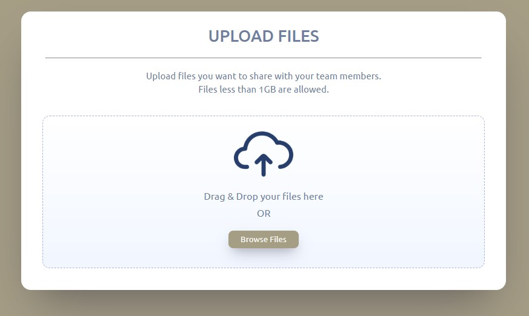
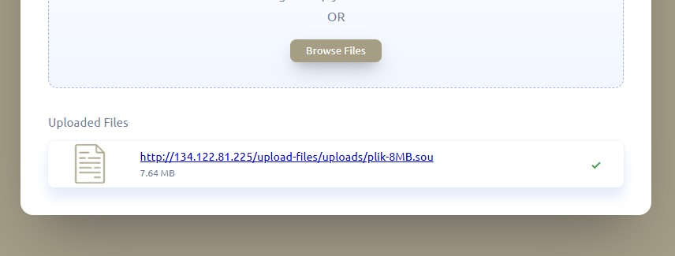
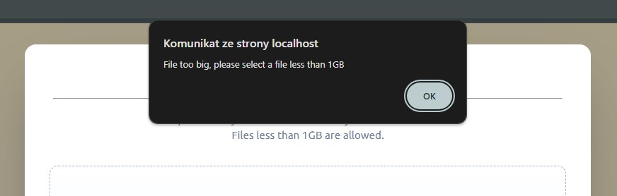

# Upload Files

## Overview

Prosta strona z formularzem za pomocą którego można przesyłać pliki do 1GB na serwer.
Po załadowaniu pliku skrypt generuje link do pobrania pliku.
Skrypt zapisuję nazwę przesłanego pliku w bazie danych PostgreSQL.

Dodatkowe wymagania:

- pliki Audio (mp3, wav) - link do pobrania ma zawierać fragment o długości 120s.

W związku z powyższym długość pliku audio, który ma być dostepny do pobrania w wersji skróconej można ustawić w pliku .env, pod zmienną 'AUDIO_DURATION'.

## How to start

Uruchom projekt lokalnie na swoim pc:

- włącz XAMPP Control Panel oraz uruchom Apache serwer,
- upewnij się, że Twój Apache serwer akceptuje bazę danych PostgresSQL (odpowiednia konfiguracja pliku php.ini),
- pobierz repozytorium na swój lokalny komputer do folderu /htdocs,

```bash
  git clone https://github.com/mateusz-przybyla/upload-files.git
```

- utwórz nową bazę danych na pgAdmin o nazwie upload_files oraz uruchom kod z pliku queries.sql w Query Tool,
- zainstaluj narzędzie FFmpeq na swoim komputerze zgodnie z https://www.wikihow.com/Install-FFmpeg-on-Windows, przykład dla Windows,
- zainstaluj wymagane zależności dla projektu:

```bash
  composer install
```

- utwórz plik o nazwie .env zgodnie z przykładowym plikiem .env.example,
- otwórz przeglądarkę i uruchom stronę lokalnie: http://localhost/upload-files/

Konfiguracja biblioteki FFmpeg w projekcie:

- w pliku .env należy wypełnić pola FFMPEG_BINARIES i FFPROBE_BINARIES, czyli ścieżki do plików wykonywalnych ffmpeq.exe i ffprobe.exe (ścieżki zależą od systemu operacyjnego),
- zauważyłem, że metoda open() klasy FFMpeg błędnie odczytuje format pliku. Dzieje się to podczas użycia metody clip() do skrócenia pliku audio, gdzie plik audio jest traktowany jako plik video i wywoływana jest metoda clip() klasy VideoFilters zamiast klasy AudioFilters (czytałem na różnych forach, że taki problem z plikami audio występuje).\
  Rozwiązanie: aby skracanie plików audio działało poprawnie, należy wprowadzić dodatkowy argument ($type) w metodzie open() klasy FFMpeg jak poniżej:

  ```php
  public function open($pathfile, $type)
  {
      if (null === $streams = $this->ffprobe->streams($pathfile)) {
          throw new RuntimeException(sprintf('Unable to probe "%s".', $pathfile));
      }

      if ($type == "video") {
          return new Video($pathfile, $this->driver, $this->ffprobe);
      } elseif ($type == "audio") {
          return new Audio($pathfile, $this->driver, $this->ffprobe);
      }

      throw new InvalidArgumentException('Unable to detect file format, only audio and video supported');
  }
  ```

  od teraz funkcja dokładnie wie, z jakim formatem mamy do czynienia, natomiast podczas wywołania metody open(), dodaję drugi argument jak poniżej:

  ```php
  $audio = $ffmpeg->open($targetFilePath, "audio");
  ```

  Powyższe zmiany dokonujemy oczywiście po zainstalowaniu zależności, tj. pakietu php-ffmpeg przy użyciu Composera.

## Screenshots

- Formularz:



- Wygenerowany link po załadowaniu pliku:



- Walidacja sprawdzająca wielkość pliku:



## Built with

- PHP, JavaScript, CSS, HTML,
- biblioteka FFmpeg - pozwalająca modyfikować, konwertować lub skracać pliki audio i video,
- Composer - zarządzanie zależnościami.

## Pomoce

- https://ffmpeg.org/
- https://github.com/PHP-FFMpeg/PHP-FFMpeg?tab=readme-ov-file
- https://www.gyan.dev/ffmpeg/builds/#release-builds
